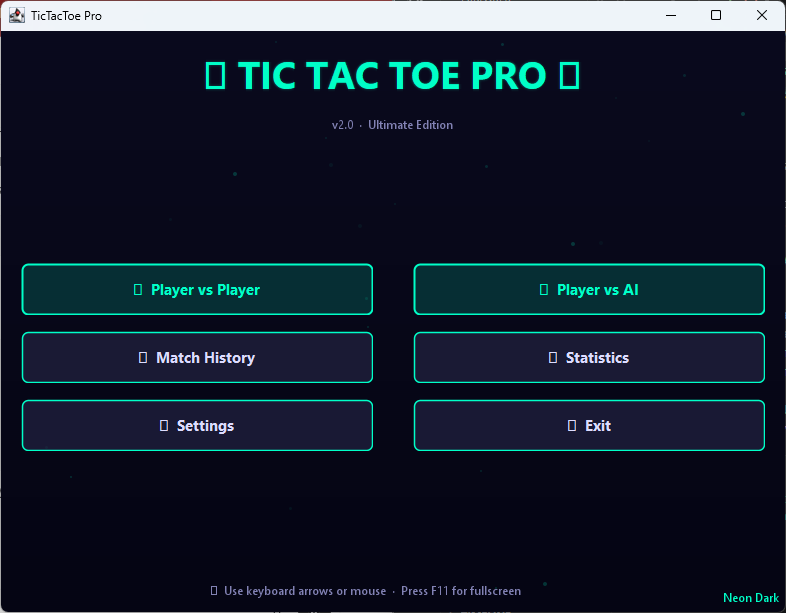
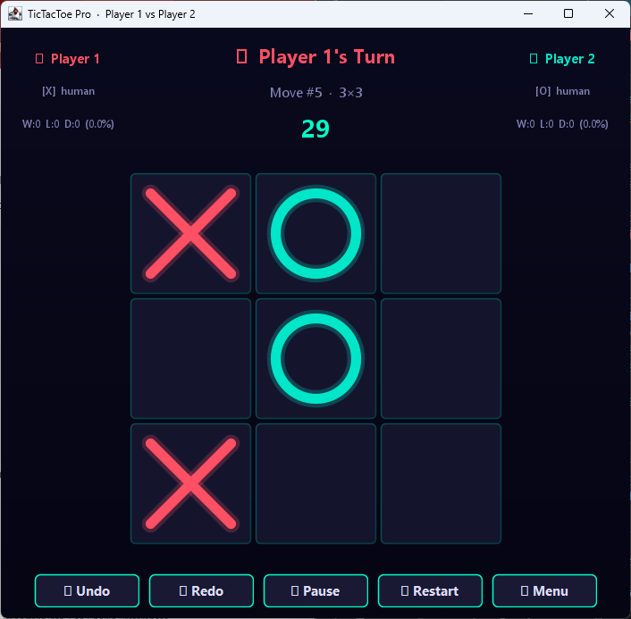
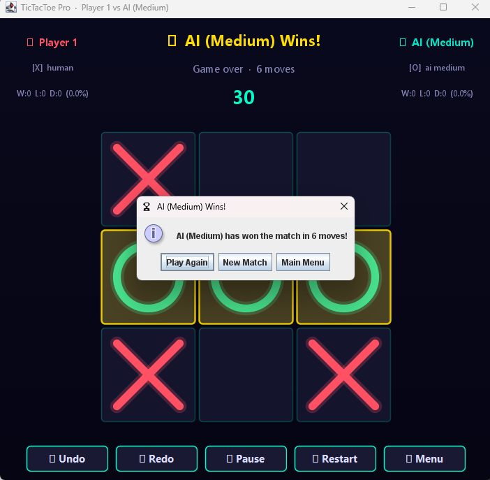
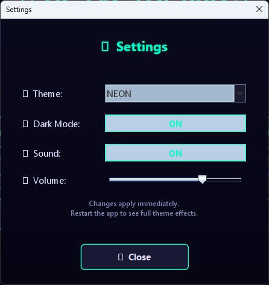
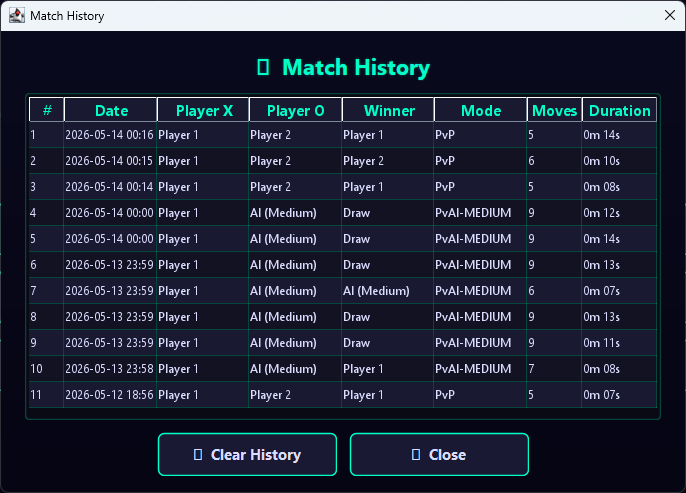
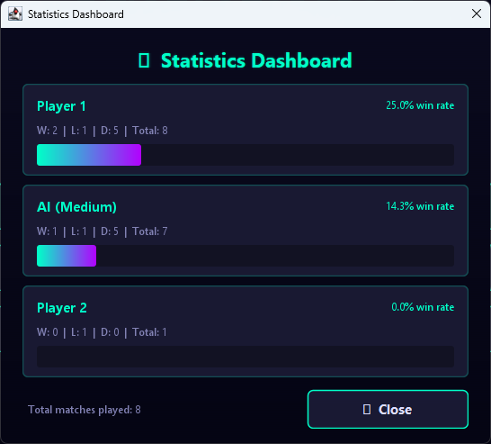

<div align="center">

# ⚡ TicTacToe Pro


### A professional, feature-rich Tic Tac Toe desktop game built using Java Swing

🎯 Unbeatable Minimax AI  
🎨 Multiple Themes  
📊 Match History & Statistics  
✨ Animated User Interface  
⚡ Zero External Dependencies

---

[✨ Features](#-features) • 
[🚀 Getting Started](#-getting-started) • 
[🗂 Project Structure](#-project-structure) • 
[🏛 Architecture](#-architecture) • 
[🔮 Roadmap](#-roadmap)

</div>

---

## 📸 Screenshots

| Main Menu | Gameplay | Game Over |
|:---------:|:--------:|:---------:|
|  |  |  |

| Settings | Match History | Statistics |
|:--------:|:-------------:|:----------:|
|  |  |  |

---

## ✨ Features

<details open>
<summary><strong>🎮 Core Gameplay</strong></summary>
<br>

- **3×3, 4×4, and 5×5** board sizes — selectable before each match
- **Player vs Player** and **Player vs AI** game modes
- **Three AI difficulty levels:**
  - 🟢 **Easy** — pure random move selection
  - 🟡 **Medium** — strategic: win → block → center → corner → random
  - 🔴 **Hard** — unbeatable **Minimax algorithm with Alpha-Beta pruning**
- Automatic win, loss, and draw detection
- **Winning cells highlighted** with a pulsing glow animation
- Invalid move prevention and strict turn enforcement

</details>

<details open>
<summary><strong>🤖 AI Engine</strong></summary>
<br>

- Minimax with Alpha-Beta pruning — provably optimal play on 3×3
- Animated AI "thinking" delay with bouncing dots for natural UX
- Auto-move via random fallback when the turn timer expires
- `AIFactory` makes swapping AI strategies trivial at runtime

</details>

<details open>
<summary><strong>🎨 UI / UX</strong></summary>
<br>

- **3 themes × 2 modes = 6 visual variants:** Neon, Arcade, Minimal in Dark & Light
- Animated **loading / splash screen** with live progress bar
- **Floating particle background** on the main menu
- Smooth **cell scale-in animation** on every placed move
- **Hover glow** effect on empty cells
- Pulsing **win highlight** on all winning cells
- Gradient backgrounds with optional CRT scanline overlay (Neon & Arcade themes)
- All colors token-driven through `ThemeManager` — swap themes with zero restart

</details>

<details open>
<summary><strong>📊 Stats & Progress</strong></summary>
<br>

- **Scoreboard** — wins, losses, draws, win percentage per player
- **Match history table** — last 500 matches, persisted to disk
- **Statistics dashboard** — animated win-rate progress bar per player
- **Achievements** — First Win, 5-Win Streak, Perfect Game, Undefeated 10
- Player profiles with avatar emoji and custom accent color

</details>

<details open>
<summary><strong>⏱ Game Controls</strong></summary>
<br>

- **Configurable turn timer** (5–120 seconds per turn)
- **Undo / Redo** — double-undoes in PvAI mode so the human always gets their turn back
- **Pause / Resume** — freezes timer and blocks all moves
- **Restart** current match without leaving the game screen
- Full **keyboard shortcut** support (see table below)

</details>

<details open>
<summary><strong>🔊 Sound & Persistence</strong></summary>
<br>

- **PCM audio synthesized at runtime** — no external sound files needed
- Sounds: click, win fanfare, draw chord, hover tick, timer warning
- Volume slider + mute toggle in Settings
- Match records auto-saved to `C:\Users\<you>\.tictactoepro\matches.dat`
- History survives app restarts and is clearable from the UI

</details>

---

## 🚀 Getting Started

### Prerequisites

| Tool | Minimum Version |
|------|----------------|
| Java JDK | **17** or higher |

```cmd
:: Confirm your Java version
java -version
```

---

### Step 1 — Clone the Repository

```cmd
git clone https://github.com/Dhxn-12/Java-Game-Projects.git
```

---

### Step 2 — Compile

```cmd
cd src
javac -d ..\out *.java
```

---

### Step 3 — Run

```cmd
cd ..\out
java App
```

> **One-liner from the `tictactoe` folder:**
> ```cmd
> javac -d out src\*.java && java -cp out App
> ```

---

### Option B — IntelliJ IDEA

1. Open `TicTacToePro\tictactoe` as a new Java project
2. Right-click `src` → **Mark Directory as → Sources Root**
3. Set Project SDK to **Java 17+**
4. Right-click `App.java` → **Run 'App.main()'**

---

### Option C — VS Code

1. Install the **Extension Pack for Java**
2. Open the `tictactoe` folder
3. Open `src/App.java` and click the ▶ **Run** button

---

## 🗂 Project Structure

```
Java-Game-Project/
└── tictactoe/
    ├── src/
    │   ├── App.java                  ← Entry point — boots managers, shows LoadingScreen
    │   │
    │   ├── ── AI Engine ──
    │   ├── AIPlayer.java             ← Abstract base; EasyAI / MediumAI / HardAI inside
    │   ├── AIFactory.java            ← Factory: create(difficulty, symbol) → AIPlayer
    │   │
    │   ├── ── Game Logic ──
    │   ├── GameBoard.java            ← Controller: turn flow, timer, AI dispatch, undo/redo
    │   ├── GameState.java            ← Board array, undo/redo stacks, move history
    │   ├── GameEvent.java            ← Event enum (MOVE_MADE, GAME_OVER, TIMER_TICK…)
    │   ├── GameEventListener.java    ← Observer interface: onGameEvent(event, data)
    │   │
    │   ├── ── Data Models ──
    │   ├── Player.java               ← Profile, stats, achievements
    │   ├── MatchRecord.java          ← Immutable completed-match snapshot
    │   │
    │   ├── ── Managers ──
    │   ├── ThemeManager.java         ← 6 theme variants; all color tokens
    │   ├── SoundManager.java         ← Real-time PCM synthesis; no audio files needed
    │   ├── ScoreManager.java         ← Serializes match records to disk
    │   │
    │   ├── ── UI Screens ──
    │   ├── LoadingScreen.java        ← Animated splash screen with progress bar
    │   ├── MainMenuScreen.java       ← Hub screen with floating particle background
    │   ├── GameSetupScreen.java      ← Names, difficulty, board size, timer config
    │   ├── GameScreen.java           ← Game window with HUD and keyboard shortcuts
    │   ├── BoardPanel.java           ← Custom-painted board with all cell animations
    │   ├── SettingsScreen.java       ← Theme, dark mode, sound, volume controls
    │   ├── HistoryScreen.java        ← Styled table of past matches
    │   ├── StatsScreen.java          ← Per-player cards with animated win-rate bars
    │   │
    │   └── ── Utilities ──
    │       └── UIUtils.java          ← Gradient helpers, glow effects, styled widgets
    │
    ├── out/                          ← Compiled .class files (auto-generated, gitignore this)
    └── screenshots/                  ← Add your PNG screenshots here
```

---

## 🏛 Architecture

The project follows **MVC** with an **Observer pattern** so the game logic never directly touches any UI class.

```
╔══════════════════════════════════════════════════════════════╗
║                        VIEW  LAYER                           ║
║  LoadingScreen → MainMenuScreen → GameSetupScreen            ║
║         GameScreen  ◄──  BoardPanel                          ║
║     SettingsScreen   HistoryScreen   StatsScreen             ║
╚═════════════════════╤════════════════════════════════════════╝
                      │  implements GameEventListener
╔═════════════════════▼════════════════════════════════════════╗
║                   CONTROLLER  LAYER                          ║
║   GameBoard ──fires──► GameEvent ──► all registered views    ║
║   Manages: turn order · timer · AI dispatch · undo/redo      ║
╚═════════════════════╤════════════════════════════════════════╝
                      │  reads / writes
╔═════════════════════▼════════════════════════════════════════╗
║                     MODEL  LAYER                             ║
║          GameState  ·  Player  ·  MatchRecord                ║
╚══════════╤═══════════════════════════╤═════════════════════╝
           │ persisted by              │ themed / heard by
    ┌──────▼──────┐            ┌───────▼──────────────────┐
    │ ScoreManager│            │ ThemeManager              │
    │ (disk save) │            │ SoundManager              │
    └─────────────┘            └──────────────────────────┘
```

### OOP Principles Applied

| Principle | Where it appears in this project |
|-----------|----------------------------------|
| **Encapsulation** | All `Player`, `GameState`, `MatchRecord` fields are `private` with getters/setters |
| **Inheritance** | `EasyAI`, `MediumAI`, `HardAI` all extend abstract `AIPlayer`, which extends `Player` |
| **Polymorphism** | `GameBoard` holds an `AIPlayer` reference and calls `chooseMove()` without knowing the concrete type |
| **Abstraction** | `AIPlayer.chooseMove()` is abstract — callers never see Minimax internals |
| **Observer** | `GameEventListener` fully decouples `GameBoard` from every UI screen |
| **Factory** | `AIFactory.create(difficulty, symbol)` centralises AI construction |
| **Singleton** | `ThemeManager`, `SoundManager`, `ScoreManager` — one instance, globally consistent |
| **MVC** | `GameState`/`Player` have zero Swing imports; `GameBoard` has zero paint calls |

---

## ⌨️ Keyboard Shortcuts

| Shortcut | Action |
|----------|--------|
| `Ctrl + Z` | Undo last move (×2 in PvAI mode) |
| `Ctrl + Y` | Redo last undone move |
| `Escape` | Pause / Resume game |
| `F5` | Restart current match |
| `F11` | Toggle fullscreen |

---

## 🎨 Themes

| Theme | Dark | Light | Character |
|-------|:----:|:-----:|-----------|
| **Neon** | ✅ | ✅ | Cyan + magenta glow on deep navy; CRT scanlines |
| **Arcade** | ✅ | ✅ | Gold + orange on near-black purple; scanlines |
| **Minimal** | ✅ | ✅ | Pure monochrome; clean and distraction-free |

Switch themes live via **Settings → Theme** — no restart needed.

---

## 🔮 Roadmap

- [ ] Online multiplayer via Java Sockets
- [ ] Match replay viewer — step through any saved game move by move
- [ ] Background music via `javax.sound.midi`
- [ ] Global leaderboard with a REST backend
- [ ] SQLite persistence to replace Java serialization
- [ ] Depth-limited heuristic AI for 5×5 boards
- [ ] Tournament bracket mode for 4+ players

---

## 📄 License

```
MIT License  ·  Copyright (c) 2025 Dhanalakshmi Sureshbabu

Permission is hereby granted, free of charge, to any person obtaining a copy of
this software and associated documentation files (the "Software"), to deal in the
Software without restriction, including without limitation the rights to use, copy,
modify, merge, publish, distribute, sublicense, and/or sell copies of the Software,
and to permit persons to whom the Software is furnished to do so, subject to the
following conditions:

The above copyright notice and this permission notice shall be included in all
copies or substantial portions of the Software.

THE SOFTWARE IS PROVIDED "AS IS", WITHOUT WARRANTY OF ANY KIND, EXPRESS OR IMPLIED,
INCLUDING BUT NOT LIMITED TO THE WARRANTIES OF MERCHANTABILITY, FITNESS FOR A
PARTICULAR PURPOSE AND NONINFRINGEMENT.
```

---

## 👤 Author

Dhanalakshmi Sureshbabu
dhanalakshmisuresh1208@gmail.com 
🔗 GitHub: [Dhxn-12](https://github.com/Dhxn-12)
💼 LinkedIn: [Dhanalakshmi Sureshbabu](https://www.linkedin.com/in/dhanalakshmi-sureshbabu)

---

<div align="center">

If this helped you, a **⭐ star** goes a long way — it helps other developers find it.

*Built with ☕ Java, a custom paint loop, and a lot of `repaint()` calls.*

</div>
